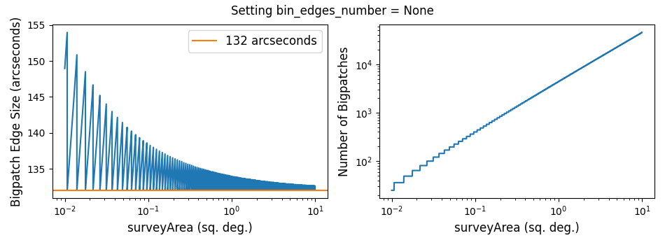

## Consequences of setting bin_edges_number = None
<!--- Code for generating the below plot in PopSyCLE/docs/bin_edges_number.py -->

Setting bin_edges_number = None instructs PopSyCLE to calculate the 
number and size of bins in which to store stars and compact objects. 
The number of galactic longitude and latitude bins is set by the survey area:

```
radius = np.sqrt(surveyArea / np.pi)  # degrees
bin_edges_number = int(60 * 2 * radius) + 1
bin_edges_number = max(bin_edges_number, 3)
```

There must be at least 2 galactic longitude and latitude bins, constructed from 
the surveyArea's radius, the calculated bin_edges_number and the l and b of the survey:
```
lat_bin_edges = np.linspace(b - 1.1 * radius, b + 1.1 * radius, bin_edges_number)
long_bin_edges = np.linspace(l - 1.1 * radius, l + 1.1 * radius, bin_edges_number)
```

`calc_events` looks through the hdf5 file one bigpatch at a time, where each bigpatch is
a concatenation of 2 by 2 adjacent bins. We can put all of this information together 
in order to calculate the number of bigpatches and the edge size of each binpatch:
```
bigpatch_number = (bin_edges_number - 2)**2
bigpatch_edge_size = 2 * 3600 * (1.1 * radius - -1.1 * radius) / (bin_edges_number - 1)
``` 

Here are the results for these variables across a wide range of survey areas:


The user can manually select a new number of bin edges by setting `bin_edges_number` 
equal to any integer greater than 2.